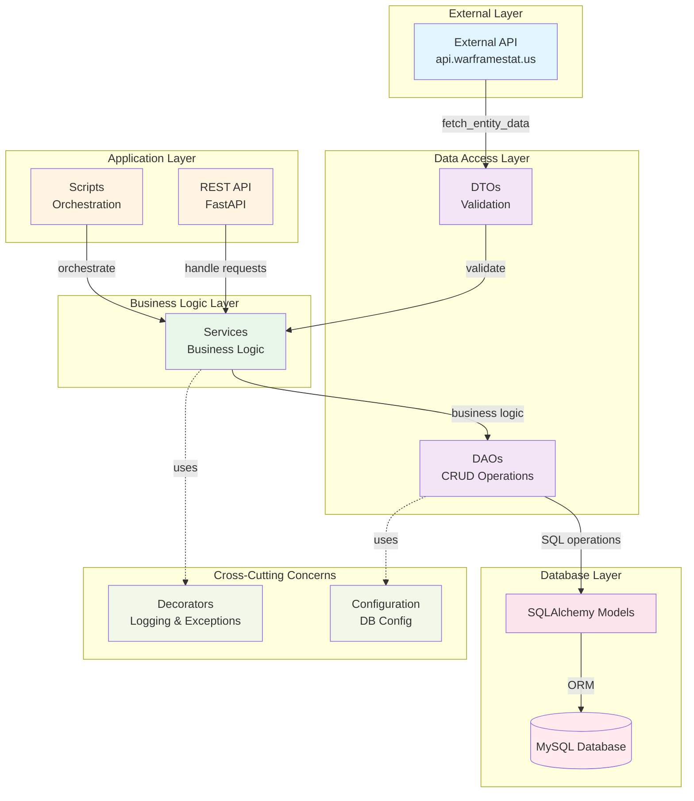
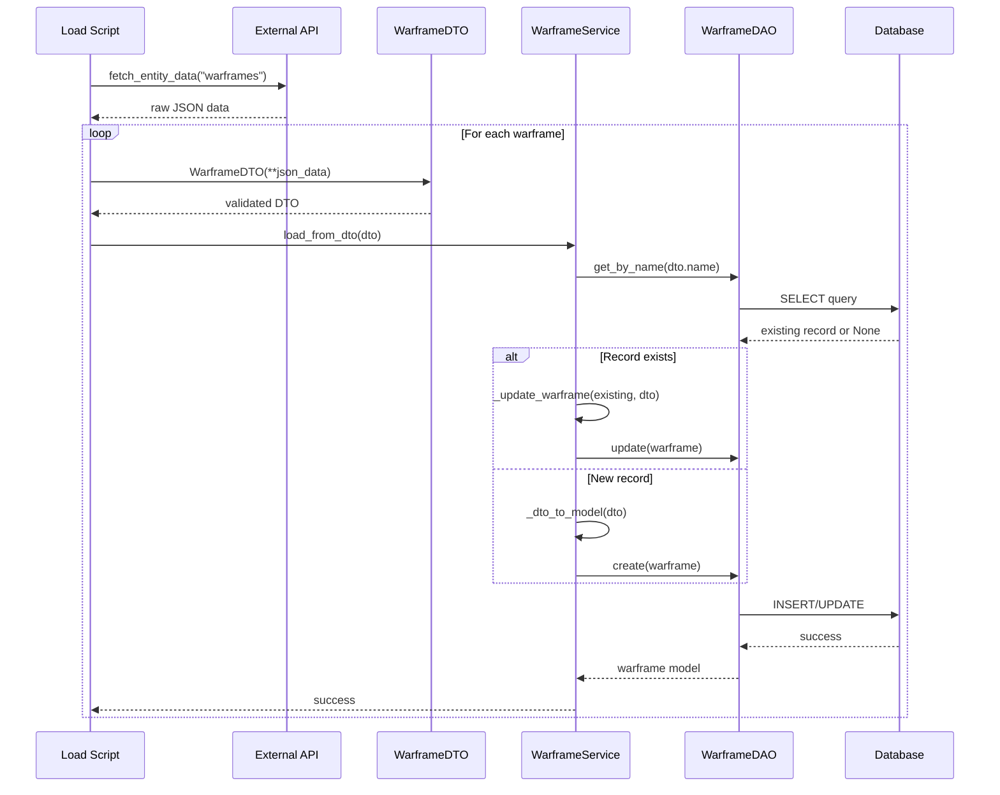
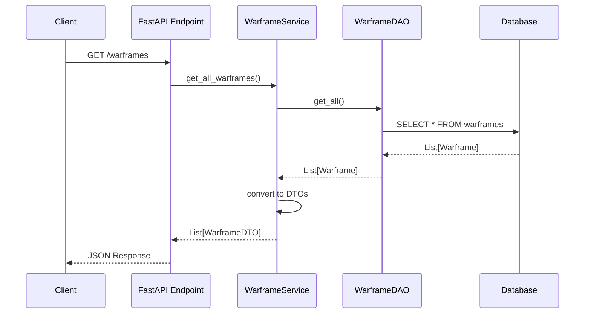
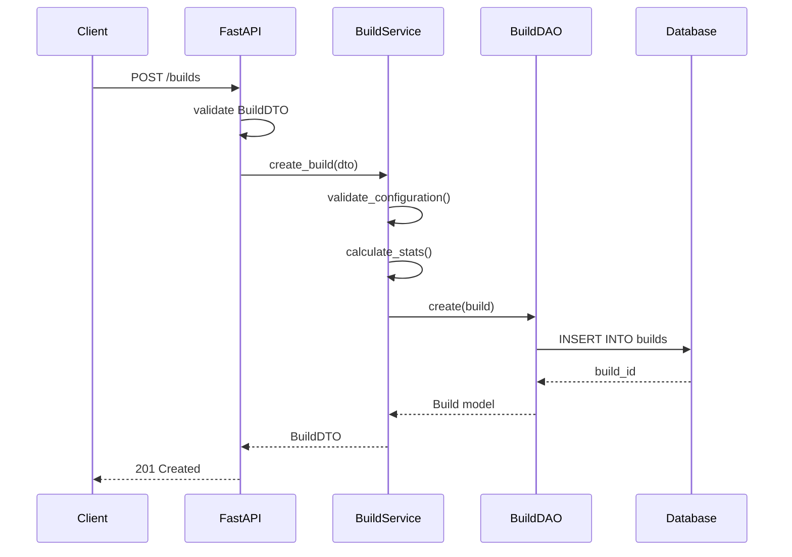

# Warframe Build Assistant - System Architecture

**Version**: 1.0  
**Last Updated**: January 2025

---

## Architecture Overview

Il progetto segue una **Layered Architecture** con separazione chiara delle responsabilità.



---

## Detailed Component Flow

### 1. Data Loading Flow



### 2. API REST Flow (Future)



### 3. Build Management Flow (Future)



---

## Layer Responsibilities

### External Layer
**Components**: External APIs  
**Responsibility**: Fornire dati di gioco aggiornati

**Files**:
- `src/database/db_fetcher/fetch_entity_data/`
- `src/database/db_fetcher/fetch_entity_names/`

### Application Layer
**Components**: Scripts, REST API  
**Responsibility**: Orchestrazione e interfaccia utente

**Files**:
- `scripts/` - Script di caricamento dati
- `src/api/` - Endpoint FastAPI (futuro)

### Business Logic Layer
**Components**: Services  
**Responsibility**: Logica business, trasformazioni, validazioni

**Files**:
- `src/services/warframe_service.py`
- `src/services/weapon_service.py`
- `src/services/mod_service.py`
- `src/services/build_service.py` (futuro)

**Key Methods**:
```python
class WarframeService:
    def load_from_dto(dto: WarframeDTO) -> Warframe
    def get_all() -> List[WarframeDTO]
    def get_by_id(id: int) -> WarframeDTO
    def update(id: int, dto: WarframeDTO) -> WarframeDTO
    def delete(id: int) -> bool
```

### Data Access Layer
**Components**: DTOs, DAOs  
**Responsibility**: Validazione dati, operazioni CRUD

**DTOs** (`src/dto/`):
- `WarframeDTO` - 14 fields
- `PrimaryWeaponDTO` - 24 fields
- `SecondaryWeaponDTO` - 24 fields
- `MeleeWeaponDTO` - 30 fields
- `ModDTO` - 12 fields
- `CompanionDTO` - 9 fields
- `AbilityDTO` - 7 fields
- `BuildDTO` - 11 fields

**DAOs** (`src/database/dao/`):
```python
class BaseDAO:
    def create(entity) -> Entity
    def get_by_id(id: int) -> Optional[Entity]
    def get_all() -> List[Entity]
    def update(entity) -> Entity
    def delete(id: int) -> bool
    def exists(id: int) -> bool
```

### Database Layer
**Components**: SQLAlchemy Models, MySQL  
**Responsibility**: Persistenza dati

**Models** (`src/database/models/`):
- `Warframe` - 14 columns
- `PrimaryWeapon` - 24 columns
- `SecondaryWeapon` - 24 columns
- `MeleeWeapon` - 30 columns
- `Mod` - 12 columns
- `Companion` - 9 columns
- `Ability` - 7 columns (FK to Warframe)
- `Build` - 11 columns (FK to multiple entities)
- `BuildMod` - Junction table

### Cross-Cutting Concerns
**Components**: Decorators, Configuration  
**Responsibility**: Logging, error handling, configurazione

**Decorators** (`src/decorators/`):
```python
@handle_logger  # Logging automatico
@handle_exception  # Gestione errori categorizzata
```

**Configuration** (`src/database/db_config/`):
```python
class DBconfig(BaseModel):
    host: str
    port: str
    user: str
    password: str
    database: str
    dialect: str
```

---

## Data Flow Patterns

### Pattern 1: External API → Database
```
External API
    ↓ fetch_entity_data()
Raw JSON
    ↓ WarframeDTO(**json)
Validated DTO
    ↓ service.load_from_dto()
Business Logic (check exists, transform)
    ↓ dao.create() / dao.update()
SQL Operations
    ↓ session.add() / session.commit()
Database
```

### Pattern 2: Database → REST API
```
Database
    ↓ dao.get_all()
SQLAlchemy Models
    ↓ service.to_dto()
DTOs
    ↓ FastAPI response
JSON Response
```

### Pattern 3: Build Creation
```
Client Request (BuildDTO)
    ↓ validate
Validated DTO
    ↓ service.create_build()
Validate Configuration
Calculate Stats
    ↓ dao.create()
Database
    ↓ response
BuildDTO with ID
```

---

## Technology Integration

### SQLAlchemy 2.0
```python
# Mapped columns with type hints
class Warframe(Base):
    id: Mapped[int] = mapped_column(Integer, primary_key=True)
    name: Mapped[str] = mapped_column(String(100))
```

### Pydantic 2.0
```python
# Automatic validation
class WarframeDTO(BaseModel):
    name: str
    health: float
    # Validates on instantiation
```

### Alembic
```python
# Auto-generate migrations
alembic revision --autogenerate -m "add warframes table"
alembic upgrade head
```

### FastAPI (Future)
```python
@app.get("/warframes", response_model=List[WarframeDTO])
async def get_warframes(dao: WarframeDAO = Depends(get_dao)):
    return dao.get_all()
```

---

## Error Handling Strategy

### Exception Categories
```python
# Business Errors
ValueError, KeyError, TypeError
→ Log as "Business error"
→ Return 400 Bad Request

# Infrastructure Errors  
ConnectionError, TimeoutError, HTTPError
→ Log as "Infrastructure error"
→ Return 503 Service Unavailable

# Code Errors
AttributeError, IndexError
→ Log as "Code error"
→ Return 500 Internal Server Error

# Unknown Errors
Exception
→ Log as "Unknown error"
→ Return 500 Internal Server Error
```

### Decorator Usage
```python
@handle_logger  # Logs function entry/exit
@handle_exception  # Catches and categorizes errors
def risky_operation():
    # Business logic
    pass
```

---

## Database Schema Overview

### Core Entities
- **Warframe** (1) ←→ (N) **Ability**
- **Build** (N) ←→ (1) **Warframe**
- **Build** (N) ←→ (1) **PrimaryWeapon**
- **Build** (N) ←→ (1) **SecondaryWeapon**
- **Build** (N) ←→ (1) **MeleeWeapon**
- **Build** (N) ←→ (1) **Companion**
- **Build** (N) ←→ (N) **Mod** (via BuildMod)

**Detailed Schema**: See `docs/01_database/design_database.md`

---

## Module Documentation

For detailed documentation on each module:

- **Database**: `docs/01_database/`
- **Data Loading**: `docs/02_modules/data_loading/`
- **API REST**: `docs/02_modules/api_rest/`
- **Build Management**: `docs/02_modules/build_management/`

---

## Design Decisions

### Why Layered Architecture?
- ✅ Clear separation of concerns
- ✅ Easy to test each layer independently
- ✅ Scalable for future features
- ✅ Standard pattern, easy to understand

### Why DTO Pattern?
- ✅ Validation at API boundary
- ✅ Decoupling from database models
- ✅ Type safety with Pydantic
- ✅ Easy serialization/deserialization

### Why DAO Pattern?
- ✅ Encapsulates SQL logic
- ✅ Reusable across services
- ✅ Easy to mock for testing
- ✅ Single responsibility principle

### Why Decorators?
- ✅ DRY principle (Don't Repeat Yourself)
- ✅ Consistent logging across codebase
- ✅ Centralized error handling
- ✅ Easy to add/remove functionality

---

## Future Enhancements

### Phase 1: Complete Current Implementation
- Finish DAO implementations
- Complete Service layer
- Implement data loading scripts

### Phase 2: API REST
- FastAPI setup
- CRUD endpoints
- Request/Response validation
- API documentation (Swagger)

### Phase 3: Build Management
- Build creation logic
- Statistics calculation
- Validation rules
- Export/Import functionality

### Phase 4: Advanced Features
- Caching layer (Redis)
- Background tasks (Celery)
- Real-time updates (WebSockets)
- AI suggestions (ML model)

### Phase 5: Production
- Docker containerization
- CI/CD pipeline
- Monitoring (Prometheus/Grafana)
- Load balancing
